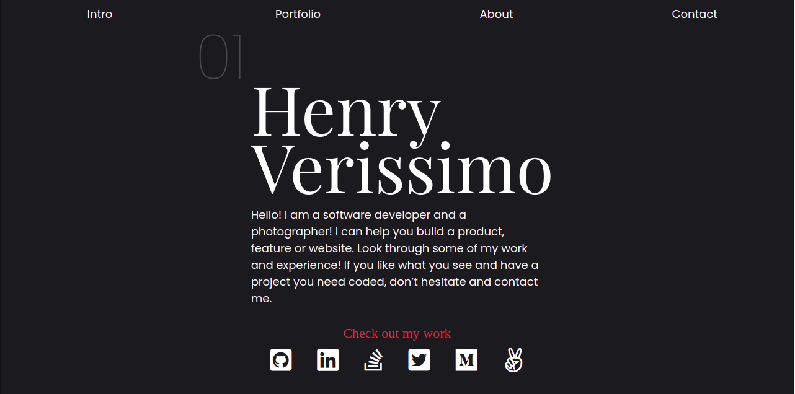
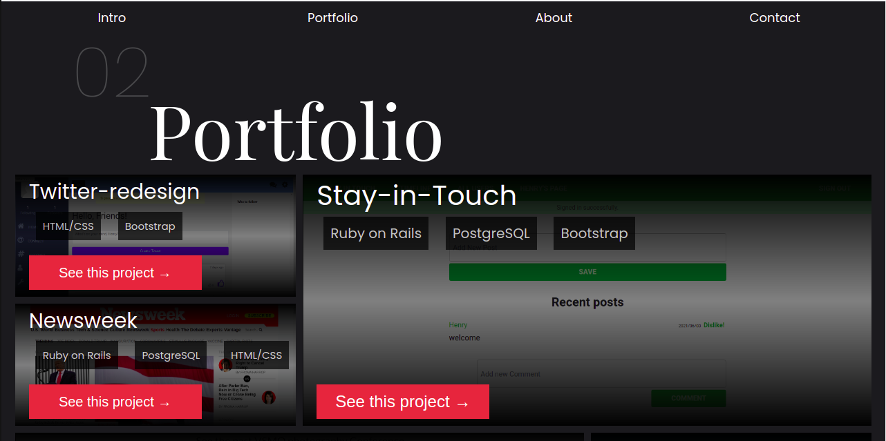

# Personal Portfolio Website

This is my personal portfolio website. Built on HTML, CSS and JavaScript. This was built with responsiveness in mind.

## Built With

- HTML
- CSS
- JavaScript

## Live Demo

[Live Demo Link](http://127.0.0.1:5501/)

### To get a local copy up and running:

1. Clone this repository or download the Zip folder.

   > `git clone git@github.com:verissimohenry/Portfolio.git`

2. Navigate to the location of the folders you have cloned
   and drop 'index.html' file into your browser

## AUTHOR

👤 **Verissimo Henry**

- Github: [@githubhandle](https://github.com/verissimohenry)
- Twitter: [@twitterhandle](https://twitter.com/verissimohenry)
- Linkedin: [linkedin](https://www.linkedin.com/in/henry-verissimo-618906167/)
- Email: verissimohenry04@gmail.com

## Contributing

Contributions, issues, and feature requests are welcome!

## Show your support

Give a ⭐️ if you like this project and how we manage to build it!
